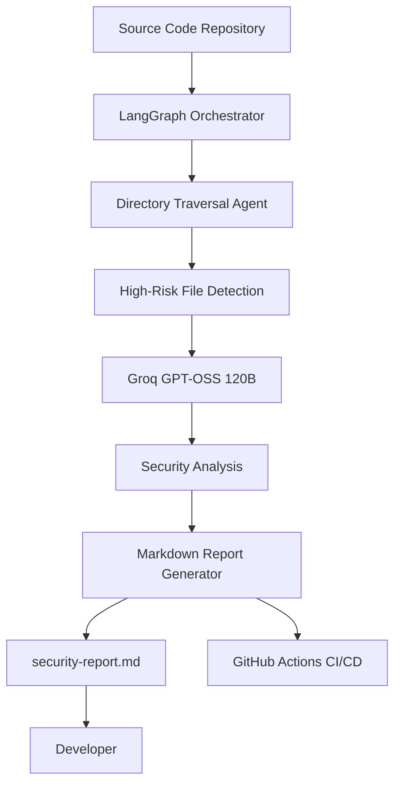

# AI Security Audit Agent

## Overview

The AI Security Audit Agent is an autonomous code security analysis tool designed to identify common security vulnerabilities in software projects. It leverages Large Language Models (LLMs) with the ReAct (Reasoning + Acting) pattern to inspect source code, prioritize high-risk files, and generate actionable security reports.

The project is designed with a shift-left security approach, enabling developers to detect vulnerabilities early during development and Continuous Integration/Continuous Deployment (CI/CD) workflows.

---

## Architecture



---

## Technology Stack

| Component          | Technology                                    |
| ------------------ | --------------------------------------------- |
| Orchestration      | LangChain / LangGraph (JavaScript/TypeScript) |
| Inference Engine   | Groq GPT-OSS 120B                             |
| Runtime            | Node.js                                       |
| Agent Pattern      | ReAct (Reasoning + Acting)                    |
| Security Framework | OWASP Top 10                                  |
| DevOps             | Docker, GitHub Actions                        |

---

## Features

### Autonomous Directory Traversal

The agent recursively scans the project structure to locate files that commonly contain security-sensitive logic, including:

* `db.js`
* `auth.js`
* `.env`
* Configuration files
* Authentication modules
* Database connection files

---

### Security Analysis

The agent analyzes the identified files for vulnerabilities aligned with the OWASP Top 10, including:

* Injection vulnerabilities
* Broken authentication
* Cryptographic failures
* Security misconfiguration
* Vulnerable dependencies
* Broken access control
* Insecure secrets management
* Other common application security risks

---

### Controlled Execution

To improve reliability, the workflow includes configurable recursion limits that act as safeguards against infinite loops or uncontrolled traversal.

---

### Automated Reporting

After analysis, the agent generates a structured Markdown report containing:

* Vulnerabilities detected
* Severity level
* Impact assessment
* Affected files
* Recommended remediation steps

---

### CI/CD Integration

The project includes GitHub Actions support to automatically execute security scans during Pull Requests.

This enables:

* Automated code review
* Early vulnerability detection
* Security report generation
* Artifact upload for audit tracking

---

## Installation

Clone the repository and install dependencies:

```bash
npm install
```

---

## Environment Configuration

Create a `.env` file in the project root:

```env
GROQ_API_KEY=your_api_key_here
```

---

## Running Locally

Start the security audit:

```bash
node index.js
```

After execution, a Markdown report named:

```text
security-report.md
```

will be generated in the project directory.

---

## GitHub Actions

The repository includes the workflow:

```text
.github/workflows/security-audit.yml
```

When code is pushed or a Pull Request is opened, GitHub Actions automatically:

1. Installs dependencies
2. Executes the security audit
3. Generates `security-report.md`
4. Uploads the report as a workflow artifact

---

## Project Structure

```text
.
├── agents/
├── tools/
├── prompts/
├── reports/
├── index.js
├── package.json
├── Dockerfile
├── .github/
│   └── workflows/
│       └── security-audit.yml
└── README.md
```

---

## Future Improvements

### Enterprise-Scale Code Analysis

The current implementation depends on the LLM context window. Future enhancements will include:

* Abstract Syntax Tree (AST) parsing
* Retrieval-Augmented Generation (RAG)
* Incremental code indexing
* Risk-based file prioritization

These improvements will allow efficient analysis of larger codebases.

---

### Enhanced File System Security

Future versions will implement strict path sanitization to ensure the agent cannot access files outside the specified project directory, reducing the risk of unintended file traversal.

---

## Limitations

* Analysis quality depends on the LLM context window.
* Large repositories may require preprocessing before inference.
* Dynamic runtime behavior is not fully analyzed.
* Results should complement, not replace, traditional security testing tools.

---

## Contributing

Contributions are welcome.

To contribute:

1. Fork the repository.
2. Create a feature branch.
3. Commit your changes.
4. Submit a Pull Request.

Please ensure all code passes the security audit before submission.

---

## License

This project is licensed under the MIT License.

---

## Author

**Riya Gupta**
