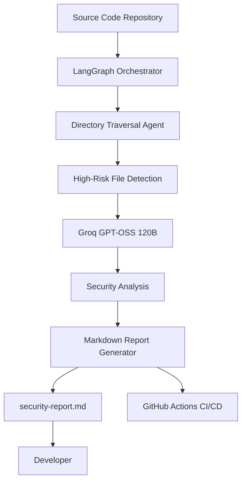

# AI Security Audit Agent

## Overview

The AI Security Audit Agent is an autonomous code security analysis tool designed to identify common security vulnerabilities in software projects. It leverages Large Language Models (LLMs) with the ReAct (Reasoning + Acting) pattern to inspect source code, prioritize high-risk files, and generate actionable security reports.

The project follows a shift-left security approach, enabling developers to detect vulnerabilities early during development and CI/CD workflows.

---

## Architecture



---

## Technology Stack

| Component          | Technology                                    |
| ------------------ | --------------------------------------------- |
| Orchestration      | LangChain / LangGraph (JavaScript/TypeScript) |
| Inference Engine   | Groq GPT-OSS 120B                             |
| Runtime            | Node.js                                       |
| Agent Pattern      | ReAct (Reasoning + Acting)                    |
| Security Framework | OWASP Top 10                                  |
| DevOps             | Docker, GitHub Actions                        |

---

## Features

### Autonomous Directory Traversal

The agent recursively scans the project structure to identify security-sensitive files, including:

* `db.js`
* `auth.js`
* `.env`
* Configuration files
* Authentication modules
* Database connection files

### OWASP Top 10 Security Analysis

The agent evaluates source code against common application security risks, including:

* Injection vulnerabilities
* Broken authentication
* Cryptographic failures
* Broken access control
* Security misconfiguration
* Vulnerable dependencies
* Insecure secrets management

### Controlled Execution

Configurable recursion limits act as circuit breakers, preventing infinite loops and ensuring stable execution.

### Automated Reporting

After analysis, the agent generates a structured Markdown report containing:

* Vulnerabilities discovered
* Severity level
* Affected files
* Security impact
* Recommended remediation steps

### CI/CD Integration

The project integrates with GitHub Actions to automatically perform security scans on Pull Requests, enabling continuous security validation throughout the development lifecycle.

---

## Installation

Clone the repository and install the dependencies:

```bash
npm install
```

---

## Environment Configuration

Create a `.env` file in the project root:

```env
GROQ_API_KEY=your_api_key_here
```

---

## Running the Auditor

Run the application locally:

```bash
node index.js
```

After execution, the generated report will be available as:

```text
security-report.md
```

---

## GitHub Actions

The repository includes the following workflow:

```text
.github/workflows/security-audit.yml
```

On every Pull Request, GitHub Actions automatically:

1. Installs project dependencies.
2. Executes the security audit.
3. Generates `security-report.md`.
4. Uploads the report as a workflow artifact.

---

## Project Structure

```text
.
├── agents/
├── prompts/
├── reports/
├── tools/
├── .github/
│   └── workflows/
│       └── security-audit.yml
├── Dockerfile
├── index.js
├── package.json
├── README.md
└── .env
```

---

## Future Improvements

### Enterprise-Scale Code Analysis

The current implementation depends on the LLM context window. Future versions will improve scalability through:

* Abstract Syntax Tree (AST) parsing
* Retrieval-Augmented Generation (RAG)
* Incremental indexing
* Risk-based file prioritization

### Enhanced File System Security

Future releases will implement strict path sanitization to prevent the agent from accessing files outside the designated project directory.

---

## Limitations

* Analysis quality depends on the LLM's context window.
* Very large repositories may require preprocessing before analysis.
* Runtime behavior is not fully analyzed.
* The agent complements, but does not replace, traditional static and dynamic security testing tools.

---

## Contributing

Contributions are welcome.

To contribute:

1. Fork the repository.
2. Create a new feature branch.
3. Commit your changes.
4. Open a Pull Request.

Please ensure your changes pass the security audit before submitting a Pull Request.

---

## License

This project is licensed under the MIT License.

---

## Author

**Riya Gupta**
